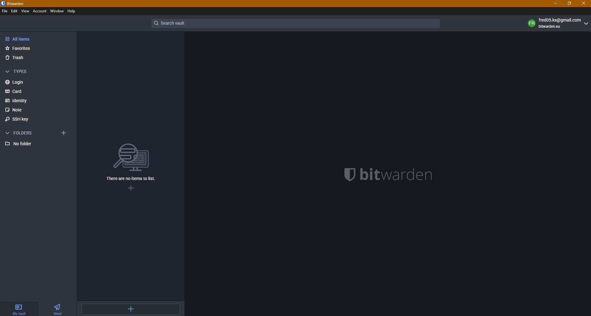
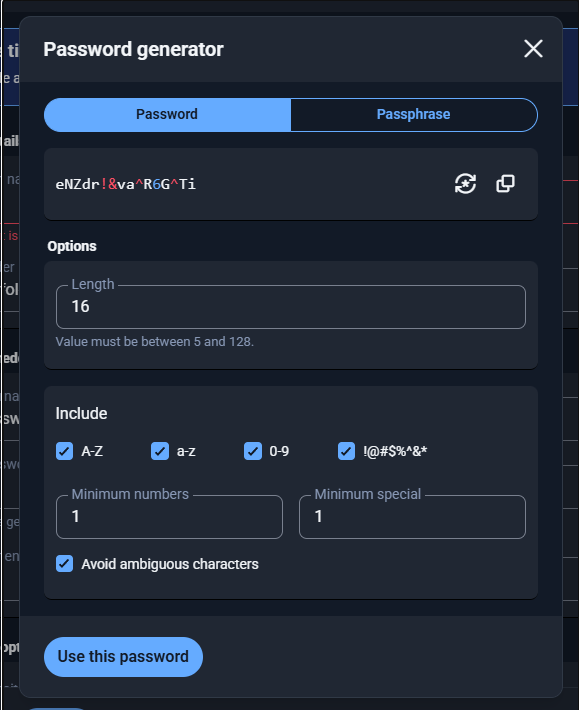
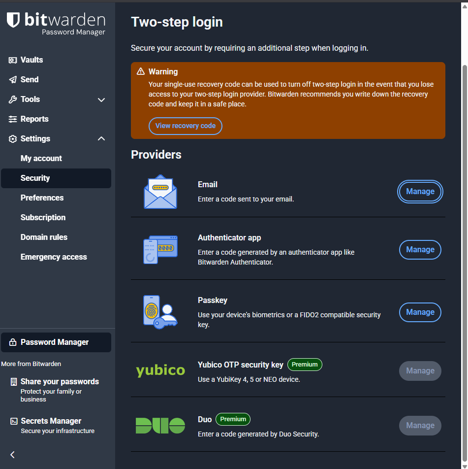

# Organizational Password Security Policy
**Version:** 1.0  
**Effective Date:** 07/10/2025
**Last Reviewed:** 07/10/2025
**Document Owner:** Freddy Morgan-Smith

---

## 1. Purpose
This policy establishes the minimum requirements for password creation, management, and security across the organization to protect information systems and data from unauthorized access.

---

## 2. Scope
This policy applies to:
- All employees, contractors, and third-party users
- All systems requiring authentication (workstations, servers, applications, cloud services)
- All organizational accounts (email, VPN, database access, etc.)

---

## 3. Password Requirements

### 3.1 Password Complexity Standards
All passwords must meet the following minimum requirements:

- **Minimum Length:** 12 characters (16+ recommended for privileged accounts)
- **Complexity:** Must include at least three of the following:
  - Uppercase letters (A-Z)
  - Lowercase letters (a-z)
  - Numbers (0-9)
  - Special characters (!@#$%^&*)
- **No Dictionary Words:** Avoid common words, names, or predictable patterns
- **No Personal Information:** Avoid birthdays, names, usernames, or easily guessable information

### 3.2 Prohibited Passwords
The following are strictly prohibited:
- Passwords previously used within the last 12 months
- Default or vendor-supplied passwords
- Passwords found in common breach databases
- Shared or group passwords
- Blank or null passwords

---

## 4. Password Management

### 4.1 Password Storage
- **NEVER** write passwords on paper or store in plain text
- **USE** an approved password manager: **Bitwarden** (organizational standard)
- Browser-saved passwords are prohibited for business-critical systems

### 4.2 Password Managers - Bitwarden
All users must utilize Bitwarden for password storage:

**Benefits:**
- Encrypted vault (AES-256 bit encryption)
- Cross-platform synchronization
- Secure password generation
- Organizational sharing capabilities

**Password Generation Example:**

---

## 5. Multi-Factor Authentication (MFA)

### 5.1 MFA Requirements
Multi-Factor Authentication is **MANDATORY** for:
- Email accounts
- VPN access
- Administrative/privileged accounts
- Cloud services (Microsoft 365, AWS, Azure, etc.)
- Financial systems
- Any system containing sensitive data

### 5.2 Approved MFA Methods
In order of preference:
1. **Hardware Security Keys** (YubiKey, Titan Key)
2. **Authenticator Apps** (Microsoft Authenticator, Google Authenticator, Authy)
3. **Push Notifications** (Duo, Okta)
4. **SMS** (least secure - only when other methods unavailable)

**Bitwarden MFA Setup:**

---

## 6. Password Lifecycle

### 6.1 Password Expiration
- **Standard User Accounts:** Change every 90 days (if no MFA), or no expiration if MFA enabled
- **Privileged Accounts:** Change every 60 days
- **Service Accounts:** Change every 180 days or when personnel change

### 6.2 Immediate Password Reset Required When:
- Suspected compromise
- Employee termination or role change
- System breach detected
- After sharing with unauthorized party (violation will be documented)

---

## 7. Account Security

### 7.1 Account Lockout Policy
- **Failed Login Attempts:** Account locks after 5 failed attempts
- **Lockout Duration:** 30 minutes or manual unlock by IT
- **Notification:** User and IT Security team notified of lockout

### 7.2 Password Reset Procedures
- Self-service password reset available through approved portal
- Identity verification required (security questions or email verification)
- Help desk may reset with proper identity verification
- Never share temporary passwords via email

---

## 8. User Responsibilities

Users must:
- ✅ Create strong, unique passwords for each system
- ✅ Use the approved password manager (Bitwarden)
- ✅ Enable MFA on all supported systems
- ✅ Never share passwords with anyone, including IT staff
- ✅ Report suspected password compromise immediately
- ✅ Log out of systems when leaving workstation unattended
- ✅ Use screen lock (Ctrl+Alt+Del → Lock) when away from desk

Users must NOT:
- ❌ Share passwords via email, chat, or verbally
- ❌ Use the same password across multiple systems
- ❌ Write passwords down or store in plain text
- ❌ Allow others to use their credentials
- ❌ Use public/shared computers for accessing business systems

---

## 9. Enforcement

### 9.1 Compliance Monitoring
- IT Security will conduct regular password audits
- Automated scans will check for weak passwords
- Non-compliant accounts will be flagged and locked

### 9.2 Violations
Policy violations may result in:
- **First Offense:** Written warning and mandatory security training
- **Second Offense:** Temporary account suspension
- **Third Offense:** Account termination and disciplinary action up to dismissal

---

## 10. Technical Implementation

### 10.1 System Administrator Responsibilities
- Configure systems to enforce password complexity requirements
- Implement automated password expiration notices (14 days, 7 days, 1 day before expiration)
- Deploy and maintain Bitwarden for organizational use
- Monitor for compromised credentials using breach databases
- Implement account lockout policies
- Maintain audit logs of password-related events

---

## 11. References & Resources

- **NIST SP 800-63B:** Digital Identity Guidelines
- **CIS Controls:** Password Policy Recommendations
- **Have I Been Pwned:** Breach monitoring service
- **Bitwarden Documentation:** https://bitwarden.com/help/

---

## 12. Policy Review
This policy will be reviewed annually or when significant security incidents occur.

**Next Review Date:** 07/10/2025

---

## Approval

**Policy Author:** Freddy Morgan-Smith
**Date:** 07/10/2025

**Approved By:** [Would be filled by organization leadership]